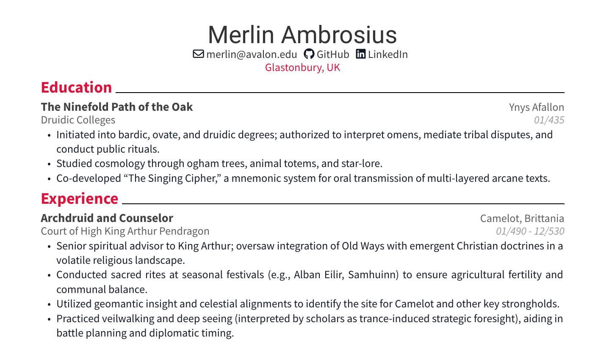
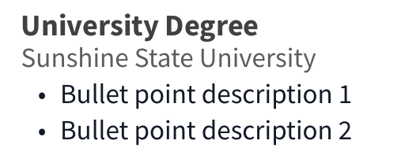

<p align="center">

</p>

# Description
This project demonstrates an easy way for R enthusiasts to create appealing resumes from a .csv file describing our professional experiences. It also uses more advanced R functionality to speed up a common workflow: creating new resumes from previously submitted ones, a strategy detailed under [Advanced Usage](#advanced-usage). 

This project uses R and Quarto to parse the raw resume data, the [targets](https://docs.ropensci.org/targets/) package to manage the rendering pipeline and [typst](https://typst.app/) to render the final .pdf document. This setup was inspired by and based on the very cool [Quarto-awesomecv-typst](https://github.com/kazuyanagimoto/quarto-awesomecv-typst) extension, and uses a version of that template which has been modified to fit my own stylistic preferences.

# Usage
The most straightforward way to use this project is to clone this repository, and copy your own data into `data/resume_data.csv`. 

To update the project dependencies, use `renv` in an R session running in the project directory:
```{R}
renv::renv_restore()
```
Note that you must [install R](https://cloud.r-project.org/) and [install Quarto](https://quarto.org/docs/get-started/) seperately, if you have not done so already. This project has been tested with R version 4.5.1 and Quarto version 1.7.32.

To build the resume, copy your resume data to `data/resume_data.csv` and call `targets::tar_make()` in an R session running in the project directory.
```{R}
targets::tar_make()
```

# Raw Data Format

If you wish to use this template without modification, supply a `resume_data.csv` file that follows the style of `data/example_data.csv`. Currently, the template divides professional experience into three headings which can be specified in the "experience_type" column: "education", "work" and "skills." The columns "title" "location" "date" and "description" define resume subheadings. You can create bulleted lists under resume subheadings by supplying markdown lists to the "bullets" column. For instance, this text:
```
- Bullet point description 1 
- Bullet point description 2 
```

Will render as:



# Advanced Usage
## Data Versioning
This project allows data versioning and basic metadata manipulation using the R [pins](https://pins.rstudio.com/) package. If you wish to take advantage of `pins` data versioning capabilities, the project contains two helper functions to expedite this. 

When running the pipeline, you can easily tag and save updated data with the helper function `tar_make_resume_tagged()`. From an R session in the project directory call:

```{R}
tar_make_resume_tagged(tag = "new-tag"))
```

This will render your resume and create a tagged version of your input data, which will come in handy when you want to use that data as a template to create a resume for a similar job posting in the future.

If you want to create a new resume by using a previously rendered resume as a template, you can select the version to base off of by calling `use_resume_data()` from an R session in the project directory:

```{R}
use_resume_data(tag = "your-tag")
```

After you have made the changes you want to the raw data file, run the targets pipeline to produce the new resume.

If you do not set any tags, all data and pipelines will be rendered with the "default" tag.

## Cloud Storage
This project will automatically use cloud S3 storage if it detects S3 keys in the project environment. To use your own S3 storage, create an `.Renviron` file in the project directory that supplies S3 storage details in the following format: 

```
S3_BUCKET=your_bucket
S3_REGION=your_region
S3_ENDPOINT=your_endpoint
AWS_ACCESS_KEY_ID=your_public_key
AWS_SECRET_ACCESS_KEY=your_private_key
```